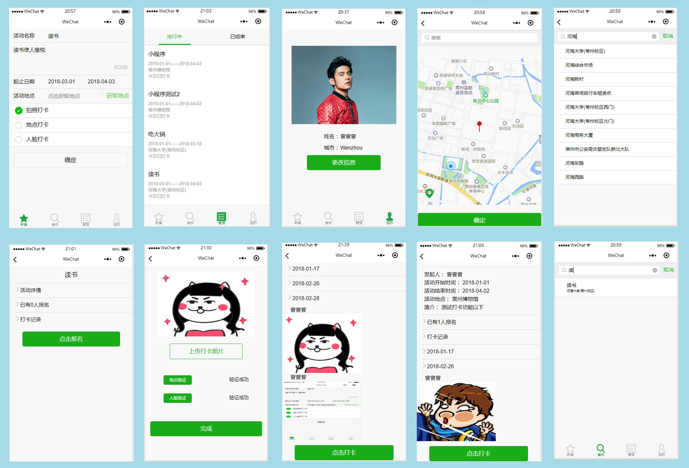

# 活动考勤签到小程序
## 效果图

## 功能
#### 创建活动
1. 可以添加活动名称、简介等信息
2. 地点选择时有搜索建议并能够在地图上标注
3. 签到方式选择包括：照片（上传活动照片）、地点（在活动地点附近500米内）、人脸（本人签到）

#### 活动搜索
1. 通过数据库的模糊搜索简单实现——每输入一个字都进行查询
2. 点击结果列表可以查看活动详情

#### 活动管理
1. 根据当前日期分成两个Tab：正在进行中、已结束
2. 点击可以进入活动详情界面

#### 活动详情
1. 查看活动的发起人、起止日期、活动地点、简介
2. 查看参与的人数
3. 活动的签到情况根据日期进行归档，点击日期可以查看当日的签到情况

#### 活动签到
1. 首先必须上传打卡照片，从相册中选择
2. 点击地点验证即可通过当前经纬度以及活动地点经纬度简单计算距离，小于500m认为在活动区域
3. 点击人脸验证，通过Face++的人脸对比接口，将上传的照片和个人信息页面的照片进行对比，置信度大于50可以认作是同一个人
4. 当所有的要求都满足后，完成活动的签到

#### 个人信息
1. 可以更改当前的照片

## 相关技术
1. 数据库采用MySQL
2. 服务器基于Nodejs的Express4.0框架搭建，简单的接收JSON数据并返回，所有的活动信息、签到结果都记录在数据库中
3. 个人信息图片、签到图片都存储在腾讯云的cos中
4. 地理位置的推荐使用腾讯的地图接口

## 项目部署
#### 客户端
1. 小程序客户端放在client文件夹，使用小程序开发工具打开
2. 填补client/checkin/config.js中的腾讯云对象存储的相关信息
3. 填补client/checkin/pages/checkIn/checkIn.js中相应的API的key等

#### 服务端
1. 安装Nodejs，执行 node app.js
2. 数据库的配置在server/checkin/congigs/config.js中

#### 数据库
执行SQL文件即可

